# How marilwyd works

marilwyd is a Matrix homeserver and an IRC bridge in one process. It serves
its own Element web client from the same origin, holds every account and
room in memory, and writes nothing to disk.

This document describes the actors it is built from, the state each one
holds, and the message sequence behind every operation it performs.

## Contents

- [The shape of the program](#the-shape-of-the-program)
- [Actors that live for the process](#actors-that-live-for-the-process)
- [Actors that live for one request](#actors-that-live-for-one-request)
- [Classes that carry state](#classes-that-carry-state)
- [The receiver protocol](#the-receiver-protocol)
- [Operations](#operations) — a sequence diagram each
- [Rules that hold everywhere](#rules-that-hold-everywhere)

---

## The shape of the program

Nothing in marilwyd is shared mutable state. Every piece of state belongs
to exactly one actor, and everything else asks that actor a question and is
answered later. There is no lock anywhere, because there is nothing to lock.

Three ideas explain most of the design.

**A request is an actor.** Every HTTP request builds a short-lived handler
actor which holds the client's connection, asks whatever it needs to ask,
and responds when the answers arrive. It then dies. A handler never blocks
and never shares.

**An answer comes back as a behaviour call, not a return value.** Asking
`SessionRegistry` who holds a token does not return a session; it calls
`token_resolved` on the asker later. Every such contract is a named
interface — the *receiver protocol* — so what can be asked and what can
come back are both visible in the types.

**The fan-out path avoids the shared actors.** A room delivers an event
straight to its members' `User` actors, which deliver to their `Device`
actors. `RoomDirectory` is consulted to *find* a room and never to deliver
into one, which is what keeps the one shared map off the path that runs
per message.

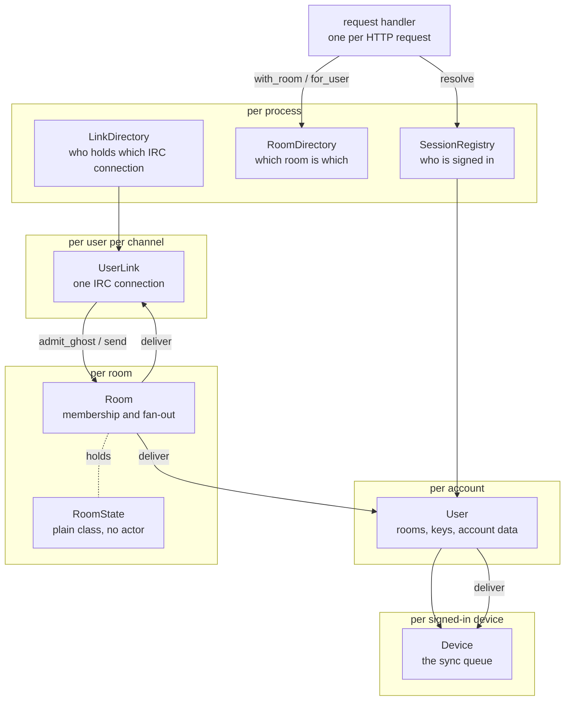

---

## Actors that live for the process

### `Main`

Reads the command line, builds the route table, declares any bridged
channels, and opens the listener. It is also the only place marilwyd is
told the server has started or failed to bind.

`Main` holds nothing but `_env`. Everything else it builds and hands away.

### `SessionRegistry` — one per process

Who is signed in, for as long as the process runs.

| Field | Holds |
|---|---|
| `_sessions` | `Array[_Session]` — token, user id, device id |
| `_users` | `Map[String, User tag]` — one actor per account |
| `_streams` | `Map[String, Map[String, Device tag]]` — devices per account |
| `_epoch` | `StreamEpoch` — distinguishes this run's stream positions |

Behaviours: `issue`, `resolve`, `devices`, `lookup_users`, `revoke`,
`revoke_devices`.

Tokens are compared **one at a time in constant time** rather than looked
up by key, so verifying a token cannot leak where it first differs from a
real one. That makes verification linear in stored sessions, and every
authenticated request pays it. `SECURITY.md` records the cost.

`_actors_for` makes a `User` and a `Device` on first use — which is why a
client that signs back in with the device id it stored finds everything
that was held for it.

### `User` — one per account

An account: which rooms it is in, which devices are signed in to it, and
everything published under its name.

| Field | Holds |
|---|---|
| `_devices` | device id → `Device tag` |
| `_rooms` | room id → `Room tag` |
| `_invites` | room id → invite state, until answered |
| `_account` | account data, by type |
| `_keys` | published device keys, by device id |
| `_master`, `_self_signing`, `_user_signing` | cross-signing keys |
| `_backups` | key backup versions |

It exists so that a `Room` has one target that does not change. Membership
is a fact about an account, and a device signing in or out is not a
membership change — if rooms held device references, every login would have
to find every room, and until it did, ORCA would keep a signed-out device's
queue alive because a room still pointed at it.

Fanning out here rather than in the room is also what keeps a room's cost
proportional to its members rather than to their devices.

### `Device` — one per signed-in device

The sync queue, and everything a client is owed.

| Field | Holds |
|---|---|
| `_pending` | `Pending[RoomEvent]` — the bounded event queue |
| `_parked`, `_parked_since` | a held `/sync` and the position it gave |
| `_state`, `_described` | room state per room, and the position it was stamped at |
| `_invites` | rooms this device has been asked into |
| `_ephemeral`, `_ephemeral_at` | receipts and typing, per room |
| `_account`, `_account_at` | account data and its position |
| `_one_time` | unclaimed one-time keys |
| `_to_device` | `Map[String, Pending[ToDeviceEvent]]`, **keyed by sending account** |

To-device messages are queued **per sender**, so one account flooding
another cannot evict a third party's messages — an attacker only evicts
their own.

`_position` advances for anything a client needs to know about, not only
events: account data and room descriptions move it too, so a position
derived from queue length would miss them.

### `Room` — one per room

Membership, fan-out, and the room's own bookkeeping.

| Field | Holds |
|---|---|
| `_state` | `RoomState` — a plain class, described below |
| `_bridge`, `_network` | the channel this room is, if it is one |
| `_members` | user id → `RoomMember tag` — who to deliver to |
| `_carrying` | user id → `RoomMember tag` — outward connections, *not* members |
| `_stalled` | whose carrier cannot currently reach the network |
| `_watching` | accounts that hear ephemeral state |
| `_receipts`, `_typing` | the ephemeral state itself |
| `_position` | the room's own event counter |

`_members` and `_carrying` are deliberately separate. A member is somebody
the room delivers to; a carrier is a connection that takes what a member
said outward. A bridged room has both for the same person, and they answer
different questions.

### `RoomDirectory` — one per process

Which room actor is which. **Deliberately not on the fan-out path**: once a
`User` has joined a room it holds that room's tag directly, so delivering
an event never comes back here.

| Field | Holds |
|---|---|
| `_rooms` | room id → `Room tag` |
| `_aliases` | alias → room id |
| `_published` | rooms listed in the public directory |
| `_channels` | alias → declared `(BridgedChannel, BridgedNetwork)` |
| `_theirs` | `alias + " " + user_id` → that person's own bridged room |

`_aliases` and `_channels` are two maps over **one** alias namespace, and
both creation paths check both — an alias that named a channel to one
endpoint and a room to another was a real defect.

### `LinkDirectory` — one per process

Every Matrix user's own IRC connection, and the one place they are made.
Keyed by `user + network + channel`, because that pairing is what a
connection is for.

Behaviours: `open`, `close`, `forget`. The last is a connection reporting
its own death, so the next join opens a fresh one rather than being
answered with a corpse.

### `UserLink` — one per Matrix user per channel

One person's IRC connection. A **bouncer, not presence**: it opens when
they join the bridged room and closes when they explicitly leave, so idling
in a channel — the ordinary way to be on IRC — is what membership means.

There is no bot. A room's traffic is carried by the connections of the
people in it, so nothing relays on anyone's behalf and nothing sees its own
words come back. That is the whole of the loop prevention: it is
structural, not a configured check.

`UserLink` implements both `irc.IRCNotify` (what the network says) and
`RoomMember` (what the room delivers), so a room fans out to it exactly as
it does to a `User` and never learns which it is holding.

---

## Actors that live for one request

Every endpoint builds one. They share a shape: capture the bearer token,
ask `SessionRegistry.resolve`, and do nothing else until `token_resolved`
arrives — so an unauthenticated caller drives no parsing, allocates no
timer, and touches no room.

| Handler | Endpoint |
|---|---|
| `_LoginHandler` | `POST /login` |
| `_LogoutHandler`, `_DevicesHandler`, `_DeleteDevicesHandler` | session management |
| `_SyncHandler` | `GET /sync` |
| `_CreateRoomHandler` | `POST /createRoom` |
| `_MembershipHandler` | `POST /join/{…}`, `POST /rooms/{id}/leave` |
| `_InviteHandler` | `POST /rooms/{id}/invite` |
| `_SendEventHandler` | `PUT /rooms/{id}/send/{type}/{txn}` |
| `_RoomStateHandler` | `GET /rooms/{id}/state`, `/members` |
| `_ReceiptHandler`, `_TypingHandler` | receipts, read markers, typing |
| `_ResolveAliasHandler`, `_PublicRoomsHandler` | the directory |
| `_UploadKeysHandler`, `_QueryKeysHandler`, `_UploadCrossSigningKeysHandler`, `_UploadSignaturesHandler` | encryption keys |
| `_ClaimKeysHandler`, `_SendToDeviceHandler` | device-to-device |
| `_CreateKeyBackupHandler`, `_KeyBackupVersionHandler` | key backup |
| `_SetAccountDataHandler`, `_GetAccountDataHandler` | account data |
| `_ProfileHandler`, `_WhoamiHandler`, `_AuthedJSONHandler` | small reads |
| `_UnrecognizedHandler` | everything else, as `M_UNRECOGNIZED` |

Three tiny actors exist only to absorb an answer nobody is waiting for:
`_IgnoreRelay`, `_IgnoreDeparture`, `_DeclaredThen`.

---

## Classes that carry state

These are not actors. They are owned by one actor and never shared mutably.

### `RoomState` — `class ref`

What a room is: who is in it and what its current state says. **No actor
and no clock**, so every rule in it is reachable from a test.

- `_state`: kind → state key → `RoomEvent`, the current state
- `_members`: who has joined
- `_invited`: who may join and has not

`leave` removes a member **and** the membership event that named them, in
one call, because membership is recorded twice here and a caller that
updated one would leave the room disagreeing with itself.

**No messages.** A room fans an event out and keeps nothing. A client that
was not a member when an event was sent will never see it.

### `Pending[A: Any val]`

A bounded queue of `(position, value)` pairs. Used for room events and, per
sender, for to-device messages. It counts what it evicted, so a device can
tell a client its timeline has a gap.

### The validated identifier types

`RoomId`, `EventId`, `DeviceId`, `AccessToken`, `RoomAlias`, `Localpart`.
Each has a private constructor and a factory that can refuse, so an invalid
one cannot be built. They exist because a room id, an event id and a user
id are all text and arrive at handlers side by side, where nothing but
parameter order would keep them apart.

`AccessToken` is **structurally unprintable** — not `Stringable`, no
`string()`, and exactly one `reveal()` in production — so it cannot be
logged by accident.

### Other values

`Config`, `Credentials`/`Credential`, `Bridges`/`BridgedChannel`/`BridgedNetwork`/`NameMapping`,
`CreateRoomRequest`, `RoomEvent`, `SyncView`, `Ephemeral`/`Receipt`,
`ToDeviceEvent`, `Session`, `StreamEpoch`, `Homeserver`, `RoomSummary`,
`KeyBackup`.

---

## The receiver protocol

Around thirty one-method interfaces name what may come back from an ask.
They are the reason a handler never blocks: it hands `this` to a
long-lived actor and gets a behaviour call later.

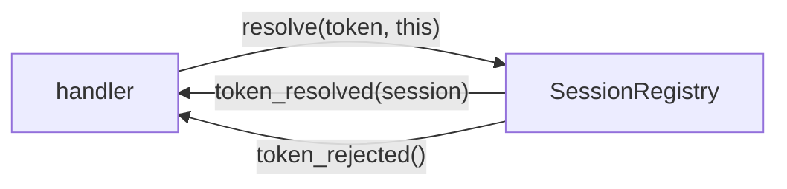

The most-used are `UserReceiver` (token resolution), `RoomLookupReceiver`,
`EventReceiver`, `MembershipReceiver`, `SyncReceiver`, `StateReceiver`,
`BridgedRoomReceiver`, `JoinReceiver` and `RoomMember`.

`RoomMember` is the important one: it is the room's entire view of a
member — `deliver`, `joined`, `departed` — and both `User` and `UserLink`
satisfy it.

---

## Operations

### Startup

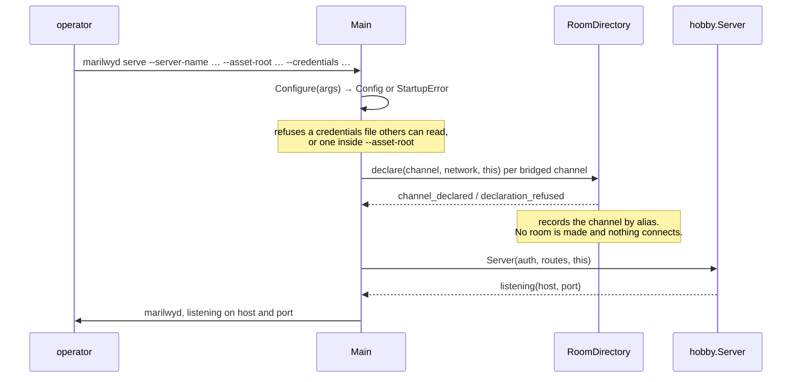

### Login

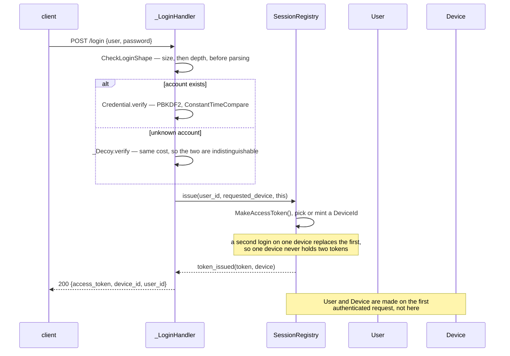

### Sync — answered at once

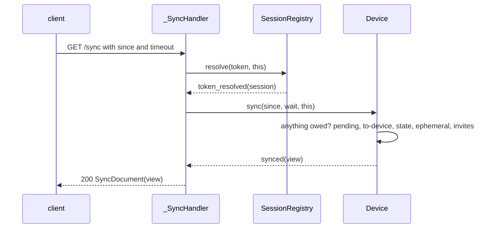

### Sync — parked, then woken

The long-poll. A sync with a position and nothing owed parks; whatever
arrives next wakes it.

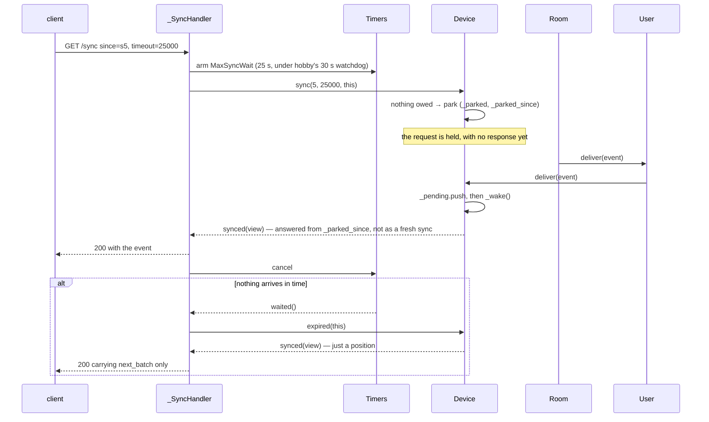

### Create a room

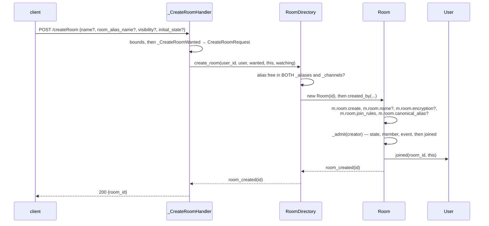

A room is **public** if it was given an alias or asked to be listed, and
**invite-only** otherwise — `m.room.join_rules` records which. Encryption
is written only if `initial_state` asked for it, and only here: there is no
endpoint that sets state on a room that already exists.

### Invite somebody

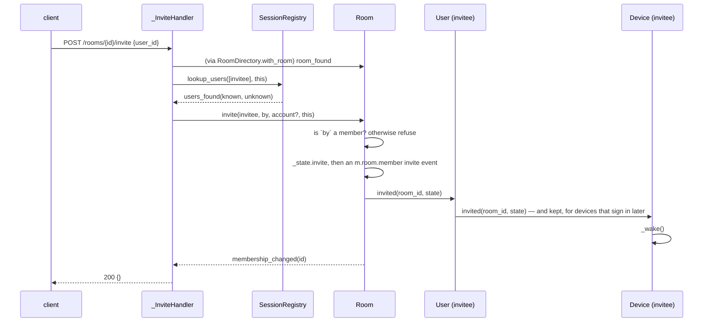

The invitee sees it in `/sync` under `rooms.invite.{id}.invite_state`,
carrying the room's state and none of its timeline.

### Join a native room

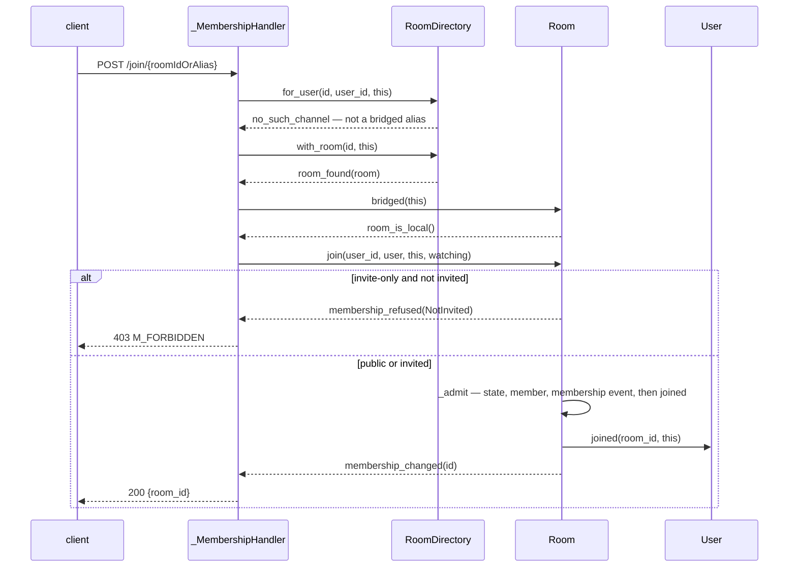

### Join a bridged channel

Membership means connected on both sides, so the Matrix join does not
complete until the IRC channel has been entered.

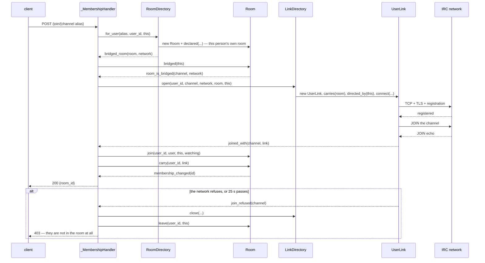

### Send a message

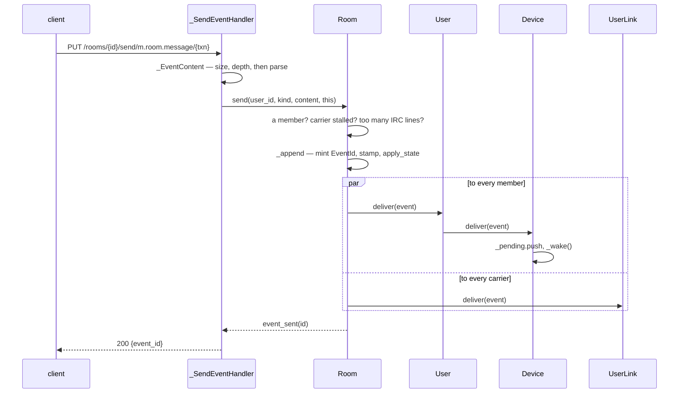

Refusals, each with its own answer: `NotInRoom` → 403, `NoEventId` → 500,
`BridgeDown` → 502, `TooManyLines` → 400.

### Matrix → IRC

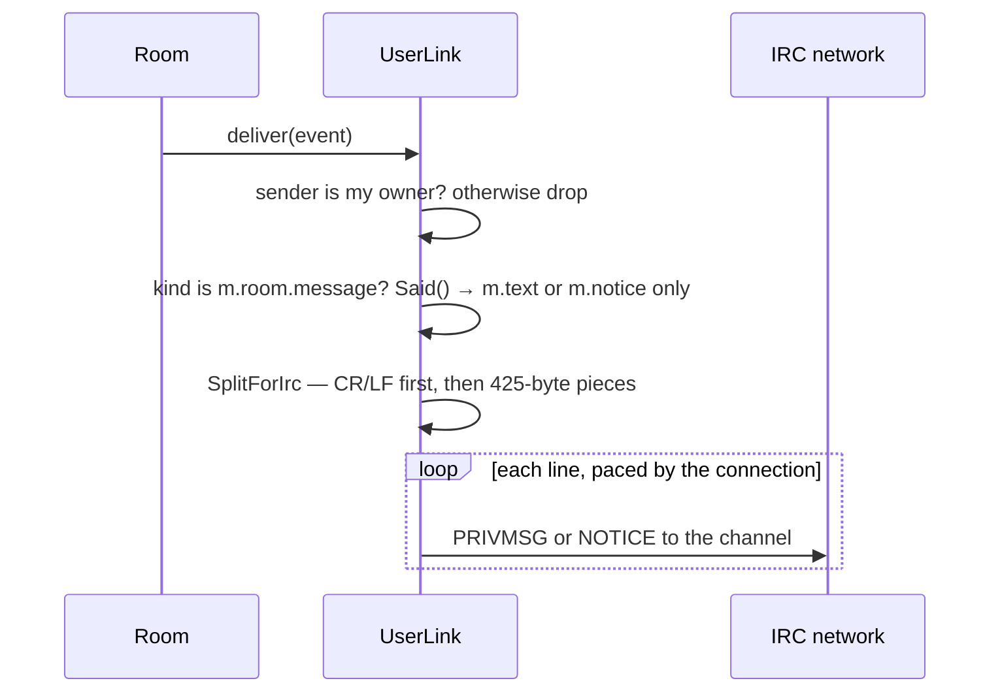

A connection relays **only its owner's** words. Everyone else in the room
has their own connection saying their own words — which is why nothing
loops and nothing is attributed to the wrong person.

### IRC → Matrix

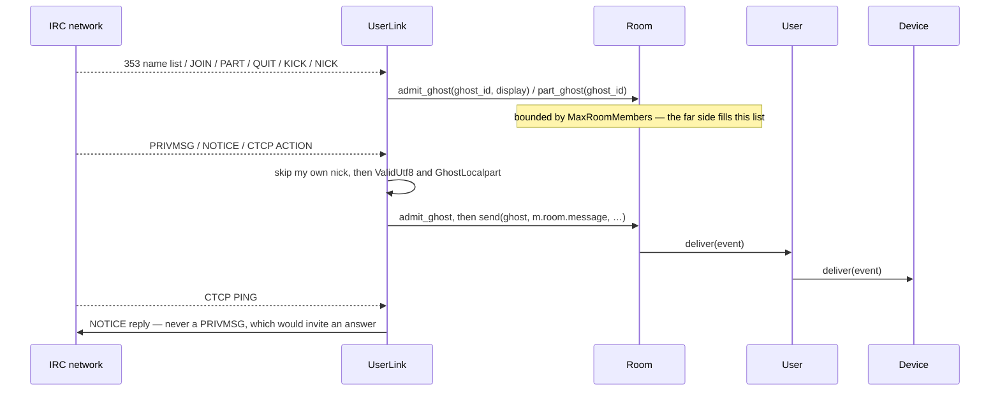

An IRC nickname becomes a Matrix id through `GhostLocalpart`, which
escapes anything a localpart may not hold as `=xx` — injectively, so two
different nicknames can never collapse into one Matrix user.

### The connection dies

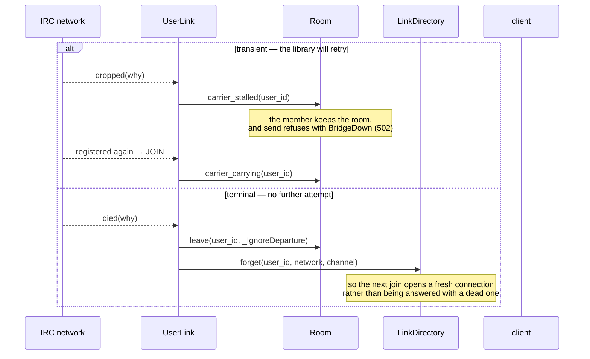

### Leave

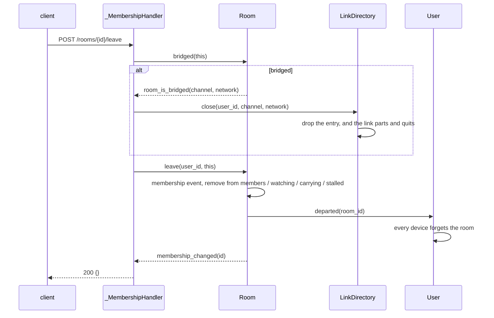

### Receipts and typing

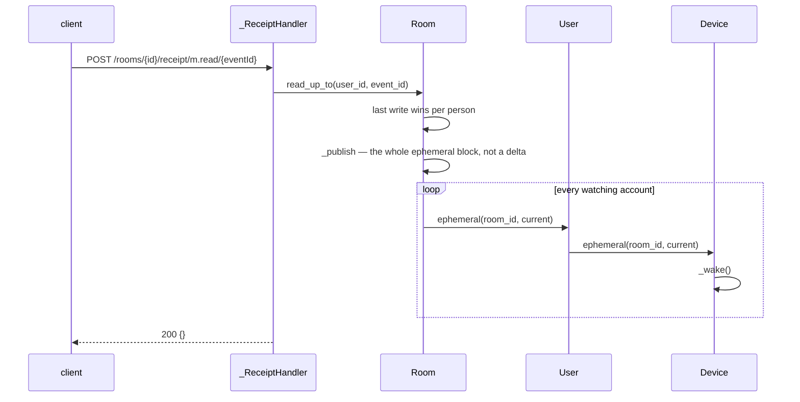

Only accounts hear ephemeral state. A bridged user's IRC connection is a
member and has no reading for a receipt.

### Publish and query encryption keys

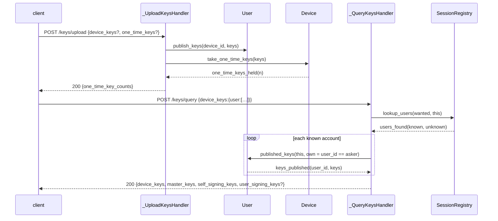

`own` is the whole of one authorisation rule: the user-signing key is what
an account uses to sign *other* people, so it goes to its owner alone. The
master and self-signing keys are public by design.

### Device to device

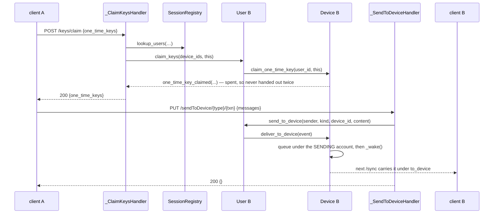

---

## Rules that hold everywhere

**Nothing survives a restart.** No account, room, message, session or
invitation is written to disk. Standing bridged channels are declared in
`bridges.yaml` and re-created at startup; everything else is gone.

**A room keeps no messages.** State is kept because a joining member needs
it to render the room at all; history is not.

**Ordering.** Pony guarantees FIFO delivery between one sender and one
receiver, and causal delivery. It does **not** order messages from two
different senders to the same receiver. Several defects in this codebase
came from assuming otherwise, and the fix is always the same: chain through
a round trip rather than assume.

**Cloning at the boundary.** Any string a long-lived actor keeps from a
request is cloned. Under ORCA a foreign reference keeps its owning actor
alive — so storing a handler's string would pin that handler, its
connection, and its request body, which on the login path holds a plaintext
password.

**Refuse rather than half-do.** A message the bridge could only carry part
of, or that arrives while the connection is down, is refused. A client told
its message failed can send it again; one told it succeeded cannot.

**Bounds at the edge.** Every request body is size- and depth-bounded
before parsing, through one checked reader. Every queue an outsider can
feed is bounded, and every per-endpoint limit sits under the transport cap
so that it can actually fire.

**What is not bounded** is stated rather than implied: there is no rate
limit on sending, per user or per room. `SECURITY.md` records it.
